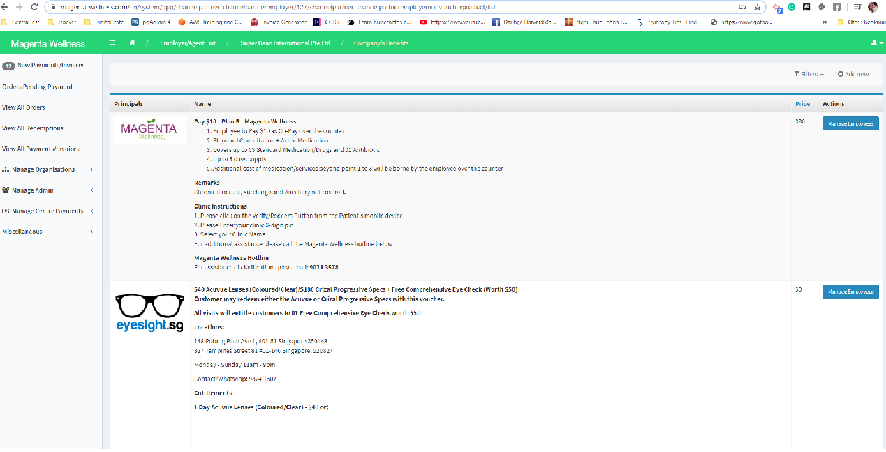
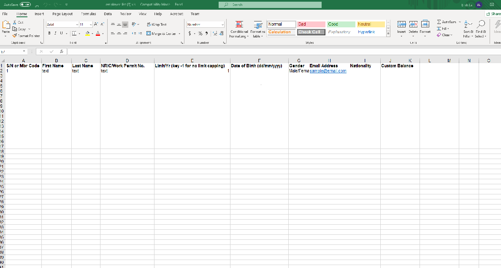
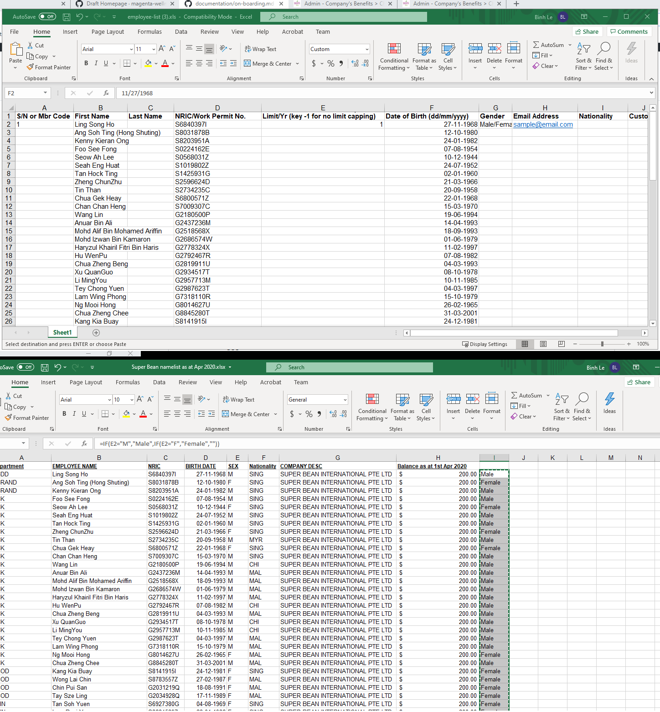

## On-boarding a Client (Employer)
### Import Employee List

#### Fresh new list with no pre-existing-employees in the system.

#### Not a fresh new list -> Add a new list to a list with pre-existing employees.
Expected behaviours:
- Non-existing NRICs: Added
- Existing NRICs:the current record gets updated
  - Current Balance gets updated to the value specified in the excel sheet
  - Balance Limit gets updated to the value specified in the excel sheet

Prepare excel file
`=IF(E2="M","Male",IF(E2="F","Female",""))`

1. Assume that you have an input file with random format such as this one -> [Sample Employee Input List](assets/sample-mrbean-existing-list-update_input.xls) 
2. As Wellness Admin, go to this page 
3. Click on **Benefits**, it will take you to this page 
4. Click on button **Manage Employees** of the product/benefit you want to import the list to, in this tutorial, we are importing to _Pay $10 - Plan B - Magenta Wellness_

[Sample Employee List](assets/sample-mrbean-existing-list-update.xls) 