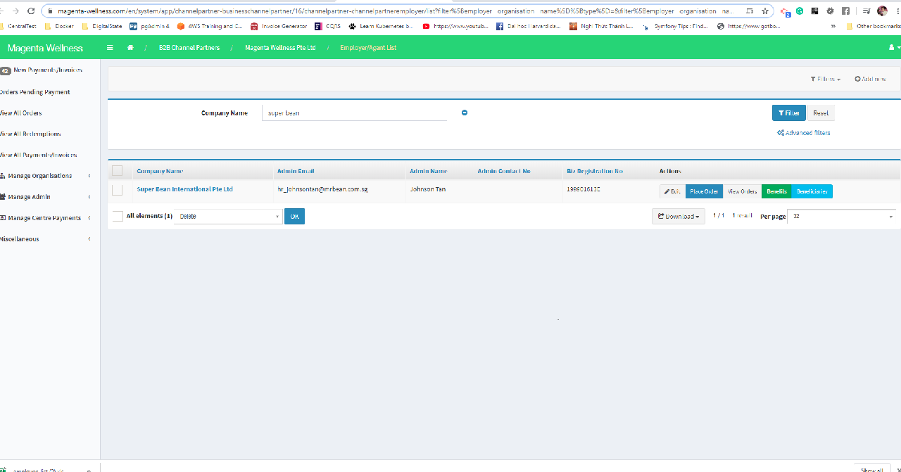
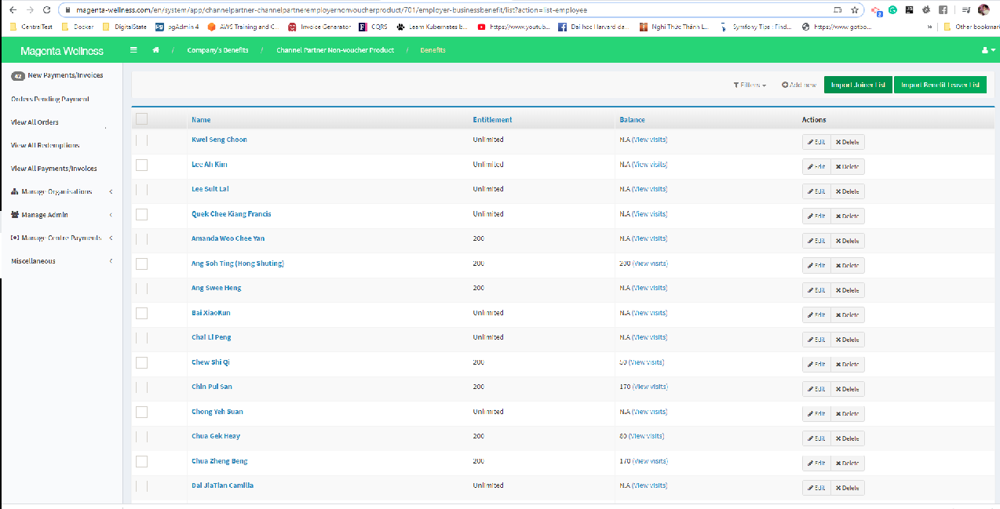
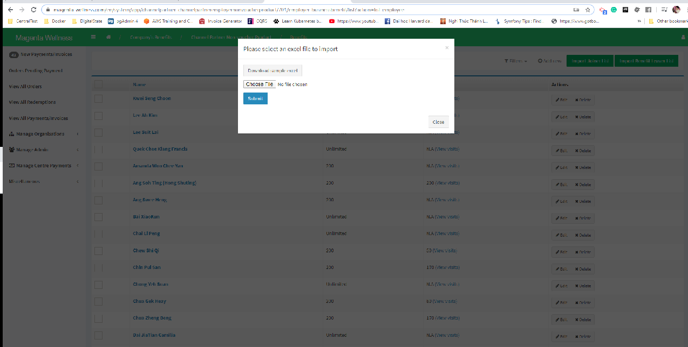
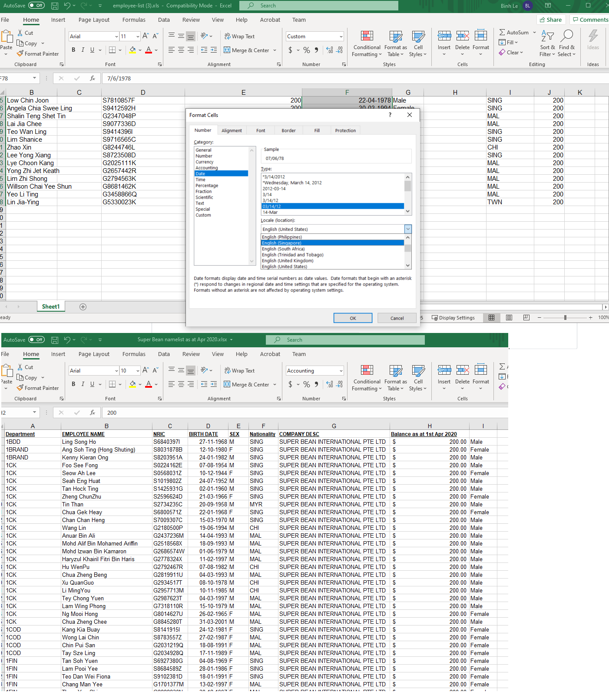
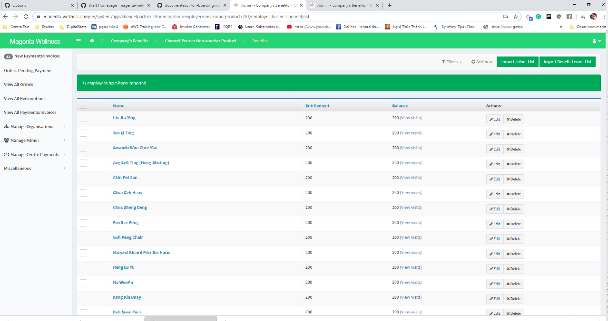

## On-boarding a Client (Employer)
### Import Employee List

#### Fresh new list with no pre-existing-employees in the system.

#### Not a fresh new list -> Add a new list to a list with pre-existing employees.
Expected behaviours:
- Non-existing NRICs: Added
- Existing NRICs:the current record gets updated
  - Current Balance gets updated to the value specified in the excel sheet
  - Balance Limit gets updated to the value specified in the excel sheet

Prepare excel file

1. Assume that you have an source file with random format such as this one -> [Sample Employee Input List](assets/sample-mrbean-existing-list-update_input.xls) 
2. As Wellness Admin, go to this page 
3. Click on **Benefits**, it will take you to this page 
4. Click on button **Manage Employees** of the product/benefit you want to import the list to, in this tutorial, we are importing to _Pay $10 - Plan B - Magenta Wellness_   
5. Download the excel import template by clicking on `Import Joiner List` and on the popup click `Download sample excel` 
6. The excel template looks like this 
7. Prepare the excel sheet by copying Plain Text columns. When copy and paste, remember to always **Paste Values only**
  7.1. Copy `Employee Name` column and paste it to `First Name` column.
  7.2. Copy `NRIC` column and paste it to `NRIC/Work Permit No.` column.
  7.3. Copy `Nationality` and paste it to `Nationality` column.
  7.4. There is no `Email Address` in the **source file** so, leave this column blank and delete the sample value (`sample@email.com`).
  7.5. Copy the `Custom Balance` and `Limit/Yr (key -1 for no limit capping)` from the corresponding columns from the **source file**. However, in this case, the **source file** only has 1 column called `Balance as at 1st April 2020` so it means we will copy this column and **Paste Values Only** them both to `Custom Balance` and `Limit/Yr`.
    - `Custom Balance` is the **current balance** amount of the employee
    - `Limit/Yr` is the number to be set to if we enable `automatic balance reset`
8. `Gender` column: this **source file** has incompatible _Gender format_ so we need to "transform" its value first by using a temporary column with a formula to transform the value such as `=IF(E2="M","Male",IF(E2="F","Female",""))` After copying the formular to the remaining cells of the column. Copy this column and **Paste Values ONLY** to our `Gender` column in our `import file`   
9. Copy `BIRTH DATE` column from the **source file** to `Date of Birth (dd/mm/yyyy)` col of the **import file**, 
  - for this `date column` just copy and paste as usual, do **NOT** Copy Values Only
  - Change date format to **dd/mm/yyyy** with **English (Singapore) Locale**   
10. When everything is done, upload the file. You can take a look at the final **import file** here -> [Sample Employee List](assets/sample-mrbean-existing-list-update.xls) 
11. As a result, 77 employee records were imported to this Product 

**What if I want to remove all beneficiaries from the product before importing?**
- You can use the `Remove From Product` batch action. If you want to remove All beneficiaries, just select `All elements` 
